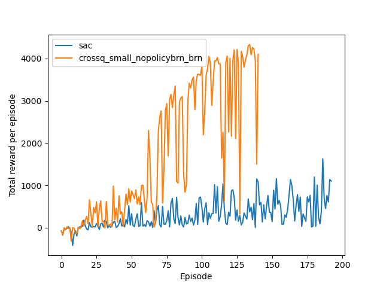
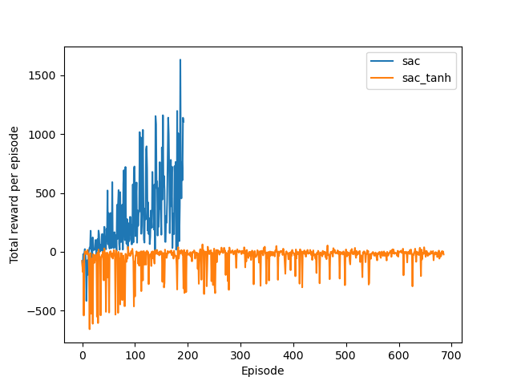

## Pytorch implementation of CrossQ

+ Original implementation: https://github.com/adityab/CrossQ
+ Paper: https://openreview.net/pdf?id=PczQtTsTIX

## Requirements:
+ gymnasium
+ pytorch
+ mujoco

## Usage

To get an agent similar to the one reported in the paper as CrossQ-small without batch norm in the policy you can use:

```
python src/main.py -- --experiment_name "crossq_small_nopolicybrn_brn" --environment "Ant-v4" --beta1_alpha 0.5 --beta1 0.5 --use_batch_norm_critic "true" --device 0 --crossqstyle "true" --update_critic_to_policy_ratio 3 --bn_momentum 0.01 --bn_mode "brn"
```

Note: bn_momentum is (1-paper) as JAX uses inverse value.

The metrics are saved in results/{$experiment_name}. You can plot the losses by using the script results/analysis.py. 

```
cd analysis
python analysis.py --experiments {$experiment_1} {$experiment_2} 
```


## Results

For Ant-v4 we got the following results comparing CrossQ (Big with batch normalisation on both critic and policy, small with batch renormalisation in critic, and default SAC).




Probably, there are some missing ingredients to get the same results as in the paper as some results I am getting are not the same as reported ones. For instance, when using tanh activation function for default SAC without CrossQ, the agent does not seem to learn.



## Acknowledgements

+ SAC version modified from https://github.com/pranz24/pytorch-soft-actor-critic
+ Batch renorm modified from https://github.com/ludvb/batchrenorm